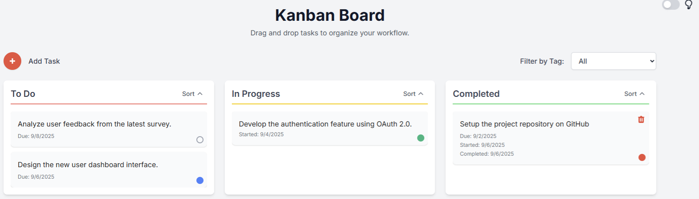

# SimpleKanban



A modern, portable Kanban board web app written in vanilla JS with local data persistence and easy extensibility for remote storage.

## Features
- **Drag-and-drop Kanban columns**: To Do, In Progress, Completed
- **Add, edit, and delete tasks**
- **Task Details Modal**: Double-click tasks to edit description, dates, stakeholders, and notes
- **Linkified Content**: Automatically detects and links emails and URLs in stakeholders and notes
- **Due dates, started/completed dates**
- **Key Stakeholders and Notes**: Store additional task information
- **Tag tasks with colored labels**
- **Filter tasks by tag**
- **Delete tags with confirmation**
- **Responsive, modern UI with dark mode toggle**
- **Local data persistence using browser localStorage**
- **Easy extension for remote data sync**

## Getting Started

1. Clone or download the project files.
2. Open `SimpleKanban.html` in your browser.
3. All data (tasks, tags, board state) is saved automatically in your browser. No server required.

## How to Use

### Adding Tasks
- Click the red circle Add Task button.
- Enter a description, due date, key stakeholders, and notes.
- Click Save. The task appears in the To Do column.

### Editing Tasks
- **Double-click any task** to open the Task Details modal.
- Edit the task description, due date, started/completed dates, stakeholders, and notes.
- **Linkification**: Emails and URLs in stakeholders/notes are automatically converted to clickable links.
- Changes are saved automatically when you close the modal or click Save Changes.

### Drag and Drop
- Drag tasks between columns to update their status.
- Task placement/order is preserved on refresh.

### Tagging Tasks
- Click the colored circle on a task to open the tag modal.
- Select an existing tag or create a new one (with color).
- Remove a tag from a task using the Remove Tag button.

### Filtering by Tag
- Use the Filter by Tag dropdown to show only tasks with a specific tag or all/unassigned tasks.

### Deleting Tasks
- Move a task to the Completed column.
- Click the delete button (red trash icon) to delete the task (requires confirmation).

### Deleting Tags
- In the tag modal, click the × button next to a tag to delete it (with confirmation). This removes the tag from all tasks.

### Dark Mode
- Use the Dark Mode toggle to switch between light and dark themes.

## Data Persistence

### Local Storage
- All board data is saved in browser localStorage under the key `kanbanBoard`.
- Data is automatically saved after every UI change (add, delete, move, tag, etc.).
- On page load, the board is restored from localStorage.

### Remote Storage (Extensible)
- The functions `saveBoardToRemoteStorage(json)` and `loadBoardFromRemoteStorage(json)` are provided as extension points.
- To sync with a server, implement these functions to POST/GET the board JSON to/from your backend.
- The board can be made multi-user or cross-device by extending these functions.

## Expected JSON Format

The board state is stored as a JSON object with the following structure:

```json
{
  "tasks": [
    {
      "text": "Task description",
      "dueDate": "YYYY-MM-DD",
      "startedDate": "YYYY-MM-DD",
      "completedDate": "YYYY-MM-DD",
      "stakeholders": "john@example.com, jane@example.com",
      "notes": "Meeting notes: https://meeting-link.com",
      "tagName": "Tag name",
      "tagColor": "#hexcolor",
      "column": "todo" | "inprogress" | "completed"
    },
    // ...more tasks
  ],
  "tags": {
    "Tag name": "#hexcolor",
    // ...more tags
  }
}
```

- **tasks**: Array of task objects, each with its text, dates, stakeholders, notes, tag info, and column.
- **stakeholders**: Comma-separated list of key stakeholders (emails and names).
- **notes**: Additional task notes and information.
- **tags**: Object mapping tag names to their colors.

## Extending for Remote Sync

- **saveBoardToRemoteStorage(json)**: Implement this function to send the board JSON to your server (e.g., via `fetch` POST).
- **loadBoardFromRemoteStorage(json)**: Implement this function to load board state from your server and call `convertJSONToBoard(json)`.

## Portability
- No dependencies except a modern browser.
- All data is stored locally by default.
- Easily portable to any environment; just copy the files.
- Can be extended for remote sync, multi-user, or team use by editing two functions.

## Advanced Usage
- You can patch UI actions, add new columns, or change the board structure by editing the JS and HTML files.
- The code is modular and well-commented for easy extension.

## Troubleshooting
- If data does not persist, check browser localStorage settings.
- For remote sync, ensure your server API matches the expected JSON format.

## License
MIT

